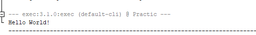
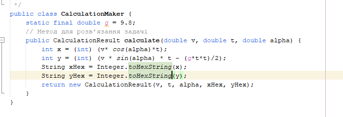
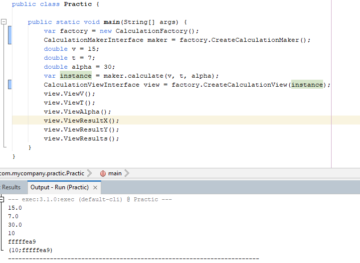
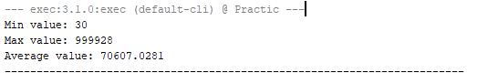

# Практика ООП
## Виконав: Пятуха Ігор, 35 гр, 2 підгрупа
# 01.03.24
Стандартна консольна програма "Hello World":

# 04.03.24
Розробити клас, що серіалізується, для зберігання параметрів і результатів обчислень.
[Файл.](src/main/java/com/mycompany/practic/calculation/CalculationResult.java)

Використовуючи агрегування, розробити клас для знаходження рішення задачі.
[Файл.](src/main/java/com/mycompany/practic/calculation/CalculationMaker.java)

Розробити клас для демонстрації в діалоговому режимі збереження та відновлення стану об'єкта, використовуючи серіалізацію. Показати особливості використання transient полів.
[Файл.](src/main/java/com/mycompany/practic/Serialization/Serializator.java)

Розробити клас для тестування коректності результатів обчислень та серіалізації/десеріалізації.
[Файл](src/test/java/com/mycompany/practic/calculation/CalculationMakerTest.java), 
[Файл2.](src/test/java/com/mycompany/practic/calculation/CalculationResultTest.java)

Визначити 16-річне подання цілісних значень координат (x = v0 * cos (α) * t; y = v0 * sin (α) * t - (g * t * t) / 2) положення фізичного тіла при русі під дією сили тяжіння.
[Файл.](src/main/java/com/mycompany/practic/calculation/CalculationMaker.java)

# 05.03.24
Розширити ієрархію інтерфейсом "фабрикованих" об'єктів, що представляє набір методів для відображення результатів обчислень.
[Файл](src/main/java/com/mycompany/practic/calculation/CalculationViewInterface.java)

Реалізувати ці методи виведення результатів у текстовому виде.
[Файл](src/main/java/com/mycompany/practic/calculation/CalculationView.java)

Розробити та реалізувати інтерфейс для "фабрикуючого" методу.
[Файл](src/main/java/com/mycompany/practic/calculation/CalculationFactory.java)
[Файл](src/main/java/com/mycompany/practic/calculation/CalculationFactoryInterface.java)

# 06.03.24
Продемонструвати заміщення (перевизначення, overriding), поєднання(перевантаження, overloading), динамічне призначення методів (Пізнє зв'язування, поліморфізм, dynamic method dispatch).
[Файл](src/main/java/com/mycompany/practic/calculation/CalculationResult.java)

Забезпечити діалоговий інтерфейс із користувачем.
[Файл](src/main/java/com/mycompany/practic/CalculationWorker.java)

Розробити клас для тестування основної функціональності.
[Файл](src/test/java/com/mycompany/practic/CalculationWorkerTest.java)

# 07.03.24
Реалізувати можливість скасування (undo) операцій (команд).
[Файл](src/main/java/com/mycompany/practic/CalculationWorker.java)
У файлі введена система якщо при введенні команди `exit`, програма завершається достроково

Продемонструвати поняття "макрокоманда"
[Файл](src/main/java/com/mycompany/practic/Practic.java)
У файлі є метод `calculateAndShowResult()` який обєднує в собі функціонал методу `calculate()` та методу `showResult*()` 

# 08.03.2024
Продемонструвати можливість паралельної обробки елементів колекції (пошук мінімуму, максимуму, обчислення середнього значення, відбір за критерієм, статистична обробка тощо).

Управління чергою завдань (команд) реалізувати за допомогою шаблону Worker Thread.

[Файл](src/main/java/com/mycompany/practic/Practic.java)

Результат виконання програми

# 12.03.2024
Розробити ієрархію класів відповідно до шаблону Observer (java) та продемонструвати можливість обслуговування розробленої раніше колекції (об'єкт, що спостерігається, Observable) різними (не менше двох) спостерігачами (Observers) – відстеження змін, упорядкування, висновок, відображення і т.д.
При реалізації ієрархії класів використати інструкції (Annotation). Відзначити особливості різних політик утримання анотацій (annotation retention policies). Продемонструвати підтримку класів концепції рефлексії (Reflection).
Використовуючи раніше створені класи, розробити додаток, що відображає результати обробки колекції об'єктів у графічному вигляді
Забезпечити діалоговий інтерфейс з користувачем та перемальовування графіка під час зміни значень елементів колекції.

[Папка](src/main/java/com/mycompany/observer_task)

