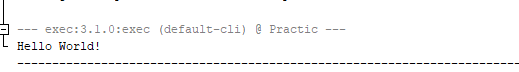

# Практика ООП
## Виконав: Пятуха Ігор, 35 гр, 2 підгрупа
# 01.03.24
Стандартна консольна програма "Hello World":

# 04.03.24
Розробити клас, що серіалізується, для зберігання параметрів і результатів обчислень.
[Файл.](src/main/java/com/mycompany/practic/calculation/CalculationResult.java)

Використовуючи агрегування, розробити клас для знаходження рішення задачі.
[Файл.](src/main/java/com/mycompany/practic/calculation/CalculationMaker.java)

Розробити клас для демонстрації в діалоговому режимі збереження та відновлення стану об'єкта, використовуючи серіалізацію. Показати особливості використання transient полів.
[Файл.](src/main/java/com/mycompany/practic/Serialization/Serializator.java)

Розробити клас для тестування коректності результатів обчислень та серіалізації/десеріалізації.
[Файл](src/test/java/com/mycompany/practic/calculation/CalculationMakerTest.java), 
[Файл2.](src/test/java/com/mycompany/practic/calculation/CalculationResultTest.java)

Визначити 16-річне подання цілісних значень координат (x = v0 * cos (α) * t; y = v0 * sin (α) * t - (g * t * t) / 2) положення фізичного тіла при русі під дією сили тяжіння.
[Файл.](src/main/java/com/mycompany/practic/calculation/CalculationMaker.java)

# 05.03.24
Розширити ієрархію інтерфейсом "фабрикованих" об'єктів, що представляє набір методів для відображення результатів обчислень.
[Файл](src/main/java/com/mycompany/practic/calculation/CalculationViewInterface.java)

Реалізувати ці методи виведення результатів у текстовому виде.
[Файл](src/main/java/com/mycompany/practic/calculation/CalculationView.java)

Розробити та реалізувати інтерфейс для "фабрикуючого" методу.
[Файл](src/main/java/com/mycompany/practic/calculation/CalculationFactory.java)
[Файл](src/main/java/com/mycompany/practic/calculation/CalculationFactoryInterface.java)

# 06.03.24
Продемонструвати заміщення (перевизначення, overriding), поєднання(перевантаження, overloading), динамічне призначення методів (Пізнє зв'язування, поліморфізм, dynamic method dispatch).
[Файл](src/main/java/com/mycompany/practic/calculation/CalculationResult.java)

Забезпечити діалоговий інтерфейс із користувачем.
[Файл](src/main/java/com/mycompany/practic/CalculationWorker.java)

Розробити клас для тестування основної функціональності.
[Файл](src/test/java/com/mycompany/practic/CalculationWorkerTest.java)

